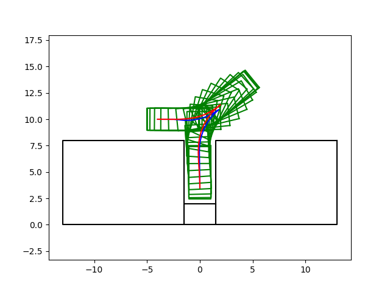

# apollo_standalone [](https://travis-ci.com/yuzhangbit/apollo_standalone)

**Tested OS: ubuntu 16.04 LTS**

This is a cmake version of the Apollo5.0 release. The project structure is much more clear and simpler than our previous work – [port_apollo](https://github.com/yuzhangbit/port_apollo).  Every `CMakelists.txt` file corresponds to a `bazel` `BUILD` file in the same folder.

## Dependencies

* protobuf(3.3.0)
* gflags(2.2.0), glog(0.3.5)
* qpOASES(master)
* osqp(0.4.1)
* curlpp(dev)
* tinyxml2(master)
* proj4(4.9.3)
* ipopt(3.12.11)
* adol-c(2.6.3)
* Eigen(dev)
* Cuda(optional, 9.0)

Some of these libraries may have already been installed to your system. You still need to run the `install_dependencies.sh` to reinstall them, since apollo `include` directories in the source codes are different from the standard ones. 


## Installation
```bash
git clone --recursive git@github.com:yuzhangbit/apollo_standalone.git
cd apollo_standalone
## install all the dependencies
bash scripts/install_dependencies.sh
```
## Build
```
mkdir -p src/apollo/build && cd src/apollo/build
cmake ..
make -j$(nproc)
sudo make install
```
All the test binary and library targets, config files and testdata will be installed to `/apollo`.

If you have followed the [instruction](https://yuzhangbit.github.io/tools/nvidia-driver-and-cuda9-installation/) and installed the `cuda`, you can enable cuda by

```bash
mkdir -p src/apollo/build && cd src/apollo/build
cmake -DENABLE_CUDA=ON ..
make -j$(nproc)
sudo make install
```

## Run Tests

```bash
bash run_all_test.bash
```

Since apollo tests need to load test data in `/apollo` directory to run, you have to do `sudo make install` first.

## Example
We provide a simple [example](./src/apollo/modules/planning/open_space/examples/open_space_demo.cpp) for open_space planner, here is the result.


**NOTE**: Not all the modules of apollo have been converted to cmake projects. We only convert codes related to `open space planners` under `apollo/modules/planning` directory.  But by referring to our CMakeLists examples, you can convert interested apollo modules to cmake projects with ease.  Below is the current converting status of apollo_standalone.

* `apollo/cyber` (done)
* `apollo/modules/common`  (done)
* `apollo/modules/planning`  (most of the functions are enabled)
* `apollo/modules/xxx` (only proto interfaces are enabled)

## Use Apollo in Other CMake Projects
Once the installation is done successfully, the apollo codes can be used in other cmake projects via `find_package` as below:
```cmake
cmake_minimum_required(VERSION 3.5.1)
project(example_project)

set(CMAKE_CXX_STANDARD 11)

list(APPEND CMAKE_PREFIX_PATH "/apollo")

find_package(apollo 5.0.0 CONFIG REQUIRED)

add_executable(listener src/listener.cc)
target_link_libraries(listener apollo::cyber)

add_executable(talker src/talker.cc)
target_link_libraries(talker apollo::cyber)
```
An `example_project` is provided in [src/example_prject](src/example_prject).

## Modules Exported
### Core Libraries
* `apollo::cyber`
* `apollo::planning`
* `apollo::common`
For these three targets, the protobuf interfaces are included.
### Module Interfaces
* `apollo::cyber_proto`
* `apollo::planning_proto`
* `apollo::common_proto`
* `apollo::canbus_proto`
* `apollo::dreamview_proto`
* `apollo::localization_proto`
* `apollo::map_proto`
* `apollo::perception_proto`
* `apollo::prediction_proto`
* `apollo::routing_proto`


Steps:
1. Find the apollo targets via the config mode.
    ```
    list(APPEND CMAKE_PREFIX_PATH "/apollo")
    find_package(apollo 5.0.0 CONFIG REQUIRED)
    ```
2. Link against the targets you need. For example, if you call some functions from `modules/planning`, you can link against `apollo::planning` as below:
    ```cmake
    add_executable(foo src/foo.cc)
    target_link_libraries(foo apollo::planning)
    # or
    add_library(foo src/foo.cc)
    target_link_libraries(foo apollo::planning)
    ```
    If you only use the protobuf interface of a module, link against the corresponding interface library:
    ```cmake
    add_executable(foo src/foo.cc)
    target_link_libraries(foo apollo::perception_proto)
    ```
    No need to worry about the dependencies. They are also exported along with these apollo targets.


